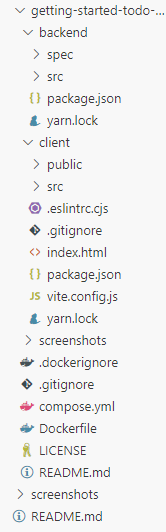
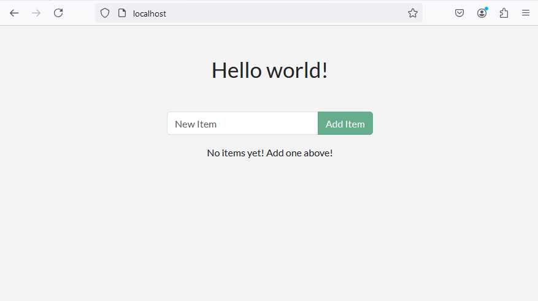
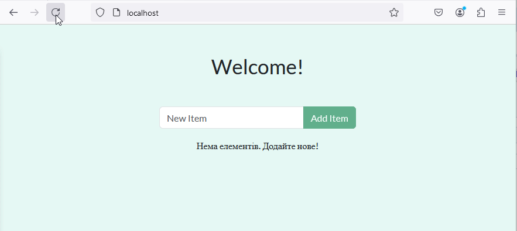
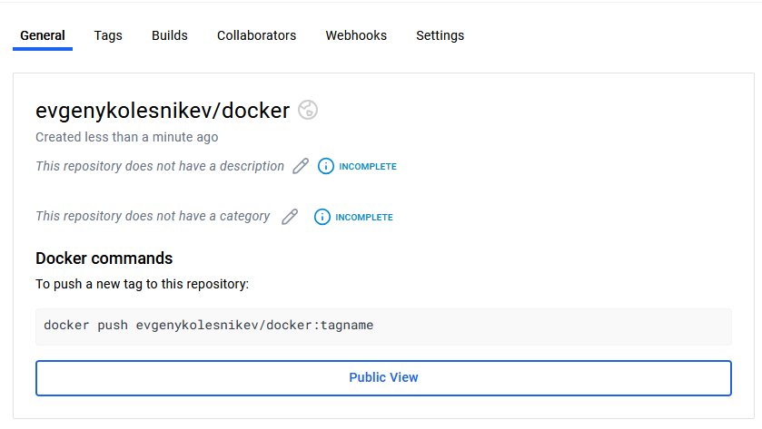

## Вивчення Docker. Колєснік Євгеній ІПЗ-4.01

## Завантаження проєкта

Склонуємо репозиторій базового проєкту з сайту `github.com`:

> git clone https://github.com/docker/getting-started-todo-app

Елементи склонованого проєкту:



## Компонування проєкту

Скомпонуємо проєкт:

> docker compose watch

Перевіримо скомпозований сайт на `http://localhost`:



## Зміна проєкту

Змінемо заголовок файлу, редагуючи файл `backend/src/routes/getGreeting.js`:

```javascript
const GREETINGS = [
    "Welcome!",
    "Have a good day!"
];

module.exports = async (req, res) => {
    res.send({
        greeting: GREETINGS[ Math.floor( Math.random() * GREETINGS.length )],
    });
};
```

Змінемо текст запрошення для додання нового елементу `No items yet! Add one above!` у файлі `client/src/components/TodoListCard.jsx`:

```javascript
<p className="text-center">Нема елементів. Додайте нове!</p>
```

Змінемо стиль сторінки у файлі `client/src/index.scss`:

```scss
body {
    background-color: #e5f8f4;
    margin-top: 50px;
    font-family: 'Lato';
}
```

## Перевірка сайту

Перевіримо скомпозований сайт на `http://localhost`:



Кожного разу привітання сторінки обирається випадковим чином.

## Публікація в DockerHub

Створімо публічний репозиторій на сайті `https://hub.docker.com` з назвою `docker`:



Побудуємо докер проєкт:

> docker build -t evgenykolesnikev/docker .